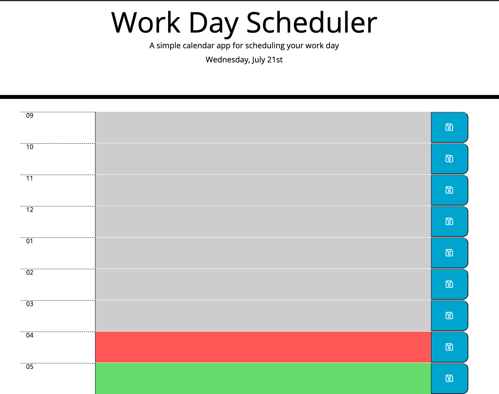

# 05 Third-Party APIs: Work Day Scheduler

## My Project

I have created a calendar application that can be opened using any web browser and is based in HTML, Javascript and CSS.

I also used the moment.js library to work with date and time.

The application can only be used during business hours (9-5). I tried to find a way to block the text areas after hours but I couldn't come up with a way to disable it.

While using the application during business hours, the user can save reminders for the day. The application will show the current time as well as all the reminders saved for that time.

The reminders can be updated with new reminders and they will be saved in the local storage.

The event will still show even if the page is reloaded.

